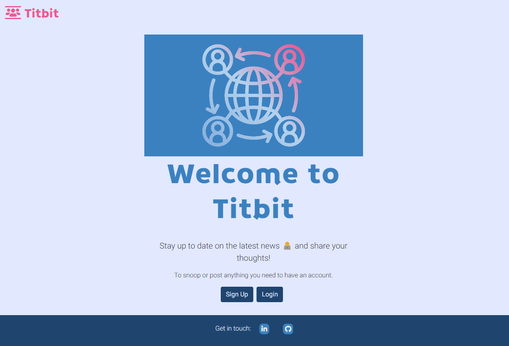
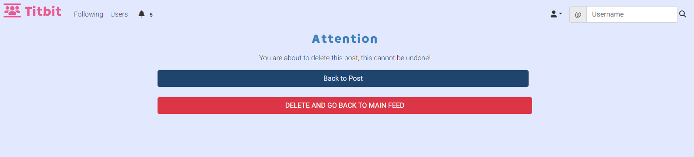

# TITBIT


Titbit is  a free social networking site where users broadcast short posts, where each user can sign up, create his own post, read, update and delete it, and also like/dislike posts from others users, follow other users, comment, like/dislike comments or reply a comment.


Link to deployed site: [Titbit](https://titbit-network.herokuapp.com/)


## 🚀 CONTENTS

* [User Experience](#user-experience)
  * [Project Goals](#project-goals)
  * [User Stories](#user-stories)

* [Design](#design)
  * [Colour Scheme](#colour-scheme)
  * [Typography](#typography)
  * [Imagery](#imagery)
  * [Wireframes](#wireframes)
  * [Database Schema & User Journey](#database-schema--user-journey)
    * [User Journey](#user-journey)
    * [First Draft Database Schema](#first-draft-database-schema)
    * [Final Database Schema](#final-database-schema)

* [Features](#features)
  * [Elements Fount on Each Page](#elements-found-on-each-page)
  * [Future Implementations](#future-implementations)
  * [Accessibility](#accessibility)

* [Technologies Used](#technologies-used)
  * [Languages Used](#languages-used)
  * [Databases Used](#databases-used)
  * [Frameworks Used](#frameworks-used)
  * [Libraries & Packages Used](#libraries--packages-used)
  * [Programs Used](#programs-used)
    * [Error Handling](#error-handling)
    * [Defensive Programming](#defensive-programming)
    * [Database Migration to ElephantSQL](#database-migration-to-elephantsql)

* [Deployment & Local Development](#deployment--local-development)
  * [Deployment](#deployment)
  * [Local Development](#local-development)
    * [How to Fork](#how-to-fork)
    * [How to Clone](#how-to-clone)

* [Testing](#testing)
  
* [Credits](#credits)
  * [Code Used](#code-used)
  * [Content](#content)
  * [Media](#media)
  * [Acknowledgments](#acknowledgments)

- - -

## 📌 User Experience
<details>

<summary>👇</summary>


### Project Goals

- - -


The aim of this project was to build a site that allows users to easily sign, keep up with titbits and interact with others users.

### User Stories

#### Persona

- - -

The target audience for Titbit are:
* over 18 years;
* titbit lovers all around the world;
* would like to stay informed;
* would like to promote something;
* would like to share informations or their thoughts on social media;
* would like to influence people;
* wants to make jokes;
* would like to engage on society.


#### New Site Users

- - -

As a first time user of the site, I want to be able to:

*Must Have*

* understand what the site is for and how to navigate the site, so I can decide wheter or not to sign up.
* register for an account, so that I can create my profile and explore the website.
* easily navigate the site, so that I can access what I need at the click of a button.


#### **Registered Users**

- - -


As a registered user of the site, I want to be able to:


*Must Have*

* log in to my account, so that I can access the website.
* log out of my account, so that I can end my session.
* have my own profile, so that I can be found from my friends.
* edit my profile, so that I can update or personalize it.
* read the new posts, so that I can keep up to date.
* create, edit, delete and view my posts, so that I can have control of my content.
* know the date and time a post was created, so that I can know how new or old the post is.
* post pictures, so that I can share moments or toughts.
* like or dislike other people's posts, so that I can let them know I enjoyed their posts.
* follow others users, so that I can view their posts on my feed.
* unfollow other users, so that I can remove their post from my feed.
* be followed, so that I can know that other users read my posts.
* view the number of likes on each post, so that I can see which is the most popular or viral.
* read the comments of posts, so that I can know the thoughts from others users and follow them.
* like other people's comments on posts, so that I can let them know I enjoyed their comment.


*Should Have*

* comment on other people's posts, so that I can be involved in the conversation.
* edit or delete my comments on other people's posts, so that I can edit or remove comments I no longer want published.
* reply comments, so that I can interate with others users.
* search for an user, so that I can find a specific user to follow him.
* delete other people's comments on my own posts, so that I can remove unwanted commments.
* be notified when other users comment or like my posts or follow/unfollow me.


*Could Have*

* reshare other people's posts, so that I can share their thoughts with my followers.
* report posts to admins, so that I can notify inappropriate content.
* block users, so that I can hide my content from unwanted users.
* reset my password, so that I can regain access to my account.
 


*Won't Have*

* call users, so that I can communicate with them more quickly.
* create communities, so that I can share content by specific theme.
* message other users, so that I can get in touch with them privately.
* write testimonials about other users, so that I can testify about the other users according to the relationship I have with them.


#### **Admin User**

- - -

As an administrator for the site I want to be able to:

*Must Have*
* remove any content from any user that could be offensive, so that I can moderate the all content.

*Should Have*
* Edit the admin panel.


*Could Have*
* access a page only for admins to see flagged user posts, so that I can see a list of posts that possibly need to be deleted.
* unflag a post if a deletion is not needed, so that I can remove it from the flagged posts list.

*Won't Have*
* suspend, block or delete users who not respect the rules, so that I can maintain site guidelines.


### Agile
The Project Boards on GitHub was used to help to organize and prioritize the tasks.
The Kanban, as an agile project management tool, helped to visualize the tasks and limit the work in progress (WIP) by moving cards between the To do, In progress and Done columns.

The MoSCow priorization and labels to user stories were used to priorize and implement the features.

* Must Have: guaranteed to be delivered (max 60% of stories)
* Should Have: adds significant value, but not vital (the rest ~20% of stories)
* Could Have: has small impact if left out (20% of stories)
* Won't Have: not a priority for this iteration


</details>

- - - 

## 📝 Design

<details>
<summary>👇</summary>

### Colour Scheme

The design is quite simple to not disctract the users. The CSS variables were used to easily update the global colour scheme by changing only one value, instead of everywhere in the CSS file.
The red color was used only on Delete Button to call attention.

| Color             | Hex                                                                |
| ----------------- | ------------------------------------------------------------------ |
| Dark charcoal|   #333|
| Light blue |   #d2dfef|
| Blue |   #89b1d6 |
| Dark blue |   #3b81c0 |
| Rosa |  #e95b95 |
| Red |  #BB2D3B |


### Typography

The [Braah One](https://fonts.google.com/specimen/Braah+One?query=braa) was used for the Logo Titbit and header elements in memory of the orkut platform.


The  [Roboto 300 light](https://fonts.googleapis.com/css?family=Roboto:300,400,500,700&display=swap) was used for the body text on the site. Roboto is a sans-serif font which allows it to be legible and is a great choice for accessibility.


[Font Awesome](https://fontawesome.com/icons/) icons were used throughout the site, such as the logo icon and social media icons in the footer.


### Imagery

* [Emojis](https://github.com/ikatyang/emoji-cheat-sheet/blob/master/README.md)
* Pictures from Error pages were dowloaded from [Pexels](https://www.pexels.com/) and edited at [Canva](https://www.canva.com/)


### Wireframes

Wireframes were created for mobile, tablet and desktop using [Balsamiq](https://balsamiq.com/).

#### Home Page (Landing Page)
The home page is the landing page that the user will access if he has not yet started a Titbit session, i.e. if the user is not logged in.


#### Sing Up, sing In and Change Password
There's a form according to the purpose of the page, but the layout are the same


#### Sing Out
There's a confirmation to avoid mistakes.


#### Profile


#### Edit Profile


#### Search Result, Users and Followers
User results list as required.


#### All Posts and Following 


#### Post Detail


#### Delete Confirmation


#### Edit Post and Comment


#### Error Pages


### Database Schema & User Journey
 
#### User Journey


#### Database Schema

* **Diagram**
An entitiy relationship diagram was created to help the visualization the relationships of the data structures and mapped it out.


* **Models**
Models created for this application:

1. **Allauth User Model**
This User Model was built using [Django's Allauth Library](https://django-allauth.readthedocs.io/en/latest/overview.html)

2. **Post Model**

| **PK** | **id** (unique) | Type | Notes |
| --- | --- | --- | --- |
| **FK** | author | ForeignKey | FK to **User** model |
|  | image | ImageField | |
|  | content | TextField | |
|  | posted_on | DateTimeField | |
|  | likes | ManyToMany | M2M to **User** model |
|  | dislikes | ManyToMany | M2M to **User** model |

3. **Comment Model**

| **PK** | **id** (unique) | Type | Notes |
| --- | --- | --- | --- |
| **FK** | author | ForeignKey | FK to **User** model |
|  |comment | TextField | |
|  | posted_on | DateTimeField | |
| **FK** | post| ForeignKey | FK to **Post** model|
|  | likes | ManyToMany | M2M to **User** model |
|  | dislikes | ManyToMany | M2M to **User** model |
| **FK**  | parent | ForeignKey | |


4. **Profile Model**

| **PK** | **id** (unique) | Type | Notes |
| --- | --- | --- | --- |
| **FK** | user | OneToOne | FK to **User** model |
|  | name | CharField | |
|  | bio | TextField | |
|  | profile_pic | CloudinaryField | |
|  | bg_pic | CloudinaryField | |
|  | birth_date | DateField | |
|  | location | CharField | |
|  | followers | ManyToMany | M2M to **User** model |


5. **Notification**


| **PK** | **id** (unique) | Type | Notes |
| --- | --- | --- | --- |
| | notification_type | IntegerField | |
| **FK** | to_user | ForeignKey | FK to **User** model |
| **FK** | from_user | ForeignKey | FK to **User** model |
| **FK** | post | ForeignKey | FK to **Post** model |
| **FK** | comment | ForeignKey | FK to **Comment** model |
| | date | DateTimeField | |
| | user_has_seen | BooleanField | |

</details>


- - -

## ⚙️ Features

- - -

<details>
<summary>👇</summary>

### Pages

The website is comprised of X pages which are extended from a base template.

1. **Home Page** (Landing Page) 

 The Home page is the landing page when the users arrive at the site for the first time or before they've logged in if they don't have an active session. They are welcome with two options buttons to either sign up for an account or log in to an existing account.


2. **Sing Up Page**

The users can create an account for themselves by entering their e-mail address, desired username and password twice to confirm. The username musst be unique.
Once the user is registered, a profile is created with default images.
If the user accidentally comes to this page instead of the login page they can get to the right page using the link in the card text.


3. **Sign In Page**

The registered users can log in with either their username or e-mail and password. They can choose to let their browser remember them if they plan on returning to the site on the same device to avoid having to log in again. 
There's a link to the sign up page too if the user accidentally navigated to this page instead of trying to create an account. If the user forgets their password they can click the link to reset it.


When the user is registered he will be redirected to the main feed and a welcome message will be displayed.


4. **Logout Page**

When the user wants to finish their session and logout, they can do so from the nav menu. When a user clicks the logout button they're met with a page asking them to confirm they want to log out. 


They're redirected to the landing page if they click the confirmation button and a message pops up confirming that they've logged out.


5. **Profile page**

The profile contains a card with the user's information including name, profile picture, background image, bio, location, birth date, number of followers and owns posts. 
If the user doesn't upload a profile picture or background image his profile has default pictures.
The list of posts has a paginator and the author of the posts can edit or delete own posts. In case of inappropriate content the admin can delete the posts as well. By clicking on the comment icon, the user will see the post in detail.
If the user is viewing their own profile then they'll have an icon to edit their profile. If they're viewing another user's profile then they'll have a button to follow or unfollow that user.
The user can click on the followers link to know who the followers are. 
There are a button under the left side menu for the option to go back to the main feed (all posts list).


6. **Edit profile page**

The user can edit their profile details including their name, profile picture, background image, bio, location and birth date. The user can also remove their profile picture or background image. 
There's a button to bring them back to their profile if they decide not to make any edits.


7. **All posts list**

This main feed shows every single post on the website from all users. It allows the user to find new users to follow and connect with. At the top of the feed there's an area for the user to create a post.
Each post is composed of the author, his profile picture, date and time of publication, content and icons for liking or commenting. It is possible to publish photos as content.
Posts are displayed in chronological order from newest to oldest and there are a paginator avoiding infinite scroll.
If the author of the post is viewing own post then there are more icons, one to edit and other to delete this post.
Each post is clickable and permit the user to see the post in detail like its comments and replies.
The user can like or dislike each post.
This feed can be accessed by clicking on the Titbit logo when the user is logged in.


8. **Following feed**

The following feed containing posts only from users they have followed. 
Posts are displayed exactly as on the "All Posts List" and offer the same options


If the user isn't following anyone or the people they're following has no posts, a message will appear saying "Try to follow other users..." which will prompt the user to follow more users to start seeing posts in this feed.


9. **Post detail**

Clicking on a post redirects the site to the  post details page. Below the post, the user will be able to comment on this post via the form and also read all the comments.


By clicking on the comment icon in a comment, all the replies from this comment will be displayed and the user can also reply it.


The comment has a rose border and the reply is small and has a blue border for the user to easily identify what is a comment and what is a reply.


10. **Edit post**

The author can edit his post by clicking on the edit icon presents in his own posts. After edition the user need to submit it clicking on the button. 
There are a button to go back without edition.


11. **Delete Post**

Posts can be deleted by the post author or admin by clicking on the delete icon. When deleting a post, the user is brought to a confirmation page to avoid posts being deleted accidentally. There's a button to bring them back to the post if the user changes their mind about deleting their post.



12. **Edit Comment**

The author can edit his comment by clicking on the edit icon presents in his own posts. After edition the user need to submit it clicking on the button. 
There's also a button to bring them back to the post where the comment was made if they hit the edit button by mistake.


13. **Delete Comment**
Comments can be deleted by the comment author or the original posts author or admin by clicking on the delete icon. 
Users are brought to a confirmation page to avoid comments being deleted accidentally. 
There's a button to bring them back to the post they commented on if the user changes their mind about deleting the comment.

12. **Search** 
The Username Search Input is on navbar and if the search matches users a list containing all users will displayed.
If the search has no results will let the user know there was no match. 
The page also contains a button to bring the user back to the feed.
[Home Page]()

13. **Followers**
If the user has followers, you can click on the follower count link on their profile to see a list of their followers. 
The user can click on the profiles in the list to view them and follow them if he want.


14. **Users**
There's a list from all users.


15. **Error pages**
If a user ends up on a page that either doesn't exist or that they shouldn't be on then they'll be shown an error page with a button to bring them back to their feed.
There are 403, 404, 405 and 500 error pages.

[Home Page]()


### Elements found on each page

* **Favicon**
The favicon is displayed next to the page title in the browser tab.


* **Logo** 
The logo is displayed on the left side menu with the title Titbit.
Clicking on it redicts to all posts, if the user is logged in.

* **Navigation** 
The Navbar is displayed on all pages of the website and allows users to navigate the site with ease. 
The navbar is comprised of a logo, the sites name, links to navigate the site, user icon and a search bar.
In the landing page has only the logo and title, the user muss be logged in to navigate the site.
Once the user is logged in the navbar displays more options, like following posts, notifications, user search and the user icon with the profile and logout link options.
Due to responsiveness, a hamburger menu is used.

  **User logged in Navbar**
  
  

  **User not logged in Navbar**

  

* **Footer** 
The footer appears across the website and includes information about the developer with links to Linkedin and GitHub. This lets the user get in touch and connect on these platforms if they wish. 

  


### Forms

The application has Post and Comment Forms, described below:

* **Post Form**
The user can create their posts at the all posts lists page, that will be displayed own profile and following feed (if he is followed). 
There are a content inpunt and an image input.
There's a placeholder in the form for the user to "Post the news :-)".


* **Comment Form**


The user can comment posts clicking on the post then filling the comment form and submit it at the post detail page.
There is only a content input. Clicking on the comment will bring up the reply input that is using the same comment form to submit the reply.


### Other Elements

* **Posts**
Each post is composed of the author, his profile picture, date and time of publication, content and icons for liking or commenting and have a dark blue border for better UX. It is possible to publish photos as content.
Posts are displayed in chronological order from newest to oldest and there are a paginator avoiding infinite scroll.
If the author of the post is viewing own post then there are more icons, one to edit and other to delete this post.
The admin has power to delete posts with inappropriate content.
Each post is clickable and permit the user to see the post in detail like its comments and replies.
The user can like or dislike each post and see the how many likes and dislikes the post has.


* **Comments**
Comments are viewed under a post at post detail page and are very similar to posts, can be liked or disliked and has a rose border.


Comments can be deleted by the comment author or post author and edited only by the comment author. There's the option to go back to the post or delete.


* **Reply a comment**
Replies are displayed under the comment parent and has a rose border as well, but a margin left to be different as the comment.
When the user click on the comment icon on the comment will appear the reply form and the information that the reply cannot be edited and only deleted from reply author.
The admin can delete it as well.

* **Back Buttons**
Back buttons allow users to easily go back if they want to go back or abort the edit or delete options. 


There are a hover effect changing the blue color  to rose to gain attention.


* **Notifications**
There are three types of notifications: like, comment and follow that permit the user knows what's going on.
The notifications tab on the nav menu shows the number of unread notifications and when a user clicks it a dropdown will appear with a list of their notifications. If a user clicks on the notification it will bring them to the user or post, to do with the notification. 
If the user wants to remove a notification without going to the associated page, they can click the X to delete it.

* **Pagination**
The pagination is implemented in the all posts list, following feed, posts on profile page, followers and search results avoiding infinite scroll and increase the user experience.
The user can easily navigate with the paginator.


- - -

### 🧠 Future Implementations 

Besides the features were registered as Won't Have in the MoSCoW prioritization in the [User Stories](#user-stories), the future implementations I would like to:

* Add change password functionality to the profile section.
* Apply paginator on Post Detail Page.
* Prepopulate the login fields after a user registers on the site and is redirected to the login page - this is good UX as we shouldn't expect a user to fill in the form with information we already have. 
* Business Profile.
* Advertisements.
* App for smartphones.

### 🗣️ Accessibility

I have been mindful during coding to ensure that the website is as accessible friendly as possible. This has been have achieved by:

* Using semantic HTML.
* Using descriptive alt attributes on images on the site.
* Providing information for screen readers where there are icons used and no text.
* Ensuring that there is a sufficient colour contrast throughout the site.


</details>

- - -

## ⚒️ Technologies Used 

<details>
<summary>👇</summary>


### 🌎 Languages Used

* HTML - main site content
* CSS - site desing and layout
* CSS :root variables - custom properties
* Javascript - user interaction
* Python - back-end programming language


### Databases Used

* [🐘 ElephantSQL](https://www.elephantsql.com/) - Postgres database

* [Cloudinary](https://cloudinary.com/) - Online static file storage

### Frameworks Used

[Django](https://www.djangoproject.com/) - Python framework

[Flask](https://pypi.org/project/Flask/) - A micro framework.

[Bootstrap](https://getbootstrap.com/) - Version 5.2.3 - CSS Framework.


### ⛑ Programs Used 

[Pip](https://pypi.org/project/pip/) - Tool for installing python packages.

[Jinja](https://jinja.palletsprojects.com/en/3.1.x/) - Templating engine.

[Balsamiq](https://balsamiq.com/) - Used to create wireframes.

[Git](https://git-scm.com/) - For version control.

[Github](https://github.com/) - To save and store the files for the website.

[Gitpod](https://gitpod.io/workspaces) - Cloud-based IDE for development.

[Heroku](https://git-scm.com/) -  Hosting the deployed back-end site.

[Google Fonts](https://fonts.google.com/) - To import the fonts used on the website.

[Balsamiq](https://balsamiq.com/wireframes/) - To create site wireframes.

[Canva](https://canva.com/) - To create images.

[Google Chrome Dev Tools](https://developer.chrome.com/docs/devtools/) - To troubleshoot and test features, solve issues with responsiveness and styling.

[Am I Responsive?](http://ami.responsivedesign.is/) To show the website image on a range of devices.

[Shields.io](https://shields.io/) To add badges to the README.


### 🚨 Error Handling 

- - - 

While researching the best way to handle errors in a Flask application using blueprints I came across the following [article](https://nrodrig1.medium.com/flask-blueprints-error-handling-and-config-file-example-d1a031070763). I really liked how this solution allowed me to create a blueprint to custom handle a number of different errors, rather than just creating a single 404 error page.

### Defensive Programming

- - - 

### Database Migration to ElephantSQL


- - -
</details>


## 👩‍💻 Deployment & Local Development

- - -
<details>
<summary>👇</summary>


### Deployment

###  🏡 Local Development

#### How to Fork

To fork the repository:

1. Log in (or sign up) to Github.

2. Go to the repository for this project, [Titbit](https://github.com/luandretta/network).

3. Click the Fork button in the top right corner.

#### How to Clone

To clone the repository:

1. Log in (or sign up) to GitHub.

2. Go to the repository for this project, [Titbit](https://github.com/luandretta/network).

3. Click on the code button, select whether you would like to clone with HTTPS, SSH or GitHub CLI and copy the link shown.

4. Open the terminal in your code editor and change the current working directory to the location you want to use for the cloned directory.

5. Type the following command in the terminal (after the git clone you will need to paste the link you copied in step 3 above):

    ```bash
    git clone { & THE LINK FROM STEP 3 }
    ```

6. Set up a virtual environment (this step is not required if you are using the Code Institute Template in GitPod as this will already be set up for you).

7. Install the packages from the requirements.txt file by running the following command in the Terminal:

    ```bash
    pip3 install -r requirements.txt
    ```

</details>

- - -

## 💬 Testing 

- - -

Please see [TESTING.md](TESTING.md) for all testing performed
- - -

## ®️ Credits 

- - -

<details> 
<summary>👇</summary>

### 🔗 Code Used 

* []()

* [How to ...? - Stack Overflow](https://stackoverflow.com/)
* [How to ...? - W3 Schools](https://www.w3schools.com/django/index.php)
* [Code Institute](https://learn.codeinstitute.net/)
* [GitHub Docs](https://docs.github.com/en/get-started/writing-on-github/working-with-advanced-formatting/organizing-information-with-collapsed-sections) 
* [Markdown Guide](https://www.markdownguide.org/basic-syntax/)
* [Get Bootstrap](https://getbootstrap.com/docs/5.3/forms/overview/) 
* [MD Bootstrap](https://mdbootstrap.com/docs/standard/content-styles/colors/) 
* [CS50’s Web Programming with Python and JavaScript](https://cs50.harvard.edu/web/2020/)
* [Django Allauth](https://django-allauth.readthedocs.io/en/latest/)
* [Bootstrap sticky footer overlapping content](https://stackoverflow.com/questions/26336190/bootstrap-sticky-footer-overlapping-content)
* [Django Channels Crash Course](https://www.legionscript.com/learning/courses/django-channels-crash-course)
* [How to use *args and **kwargs in Python](https://www.youtube.com/watch?v=TbeP0zv5D18)
* [Templates Django-allauth](https://github.com/pennersr/django-allauth)
* [Conventinal Commits](https://www.conventionalcommits.org/en/v1.0.0/)
* [Cloudinary](https://cloudinary.com/documentation/diagnosing_error_codes_tutorial)
* [User Notifications](https://www.youtube.com/watch?v=_JKWYkz597c&list=PLPSM8rIid1a3TkwEmHyDALNuHhqiUiU5A&index=14)
* [Custom template tags and filters](https://docs.djangoproject.com/en/3.1/howto/custom-template-tags/)
* [Making queries](https://docs.djangoproject.com/en/4.2/topics/db/queries/#chaining-filters)
* [How to perform OR condition in django queryset?](https://stackoverflow.com/questions/6567831/how-to-perform-or-condition-in-django-queryset)
* [Django and Static Assets](https://devcenter.heroku.com/articles/django-assets)
* [POP, IMAP, and SMTP settings for Outlook.com](https://support.microsoft.com/en-us/office/pop-imap-and-smtp-settings-for-outlook-com-d088b986-291d-42b8-9564-9c414e2aa040)
* [How to Send Email with Django](https://www.abstractapi.com/guides/django-send-email)
* [Testing Tools](https://docs.djangoproject.com/en/4.2/topics/testing/tools/#django.test.Client.get)
* [Unit Test](https://adamj.eu/tech/2020/06/15/how-to-unit-test-a-django-form/)
* [Redirect after successful password change](https://github.com/pennersr/django-allauth/issues/468)

### 📝 Content 

Content for this project was written by me, Lucimeri Andretta. 

### Media

* 

### 👋 Acknowledgments 

I would like to acknowledge the following people who helped me along the way in completing this project: 🫶

</details>

