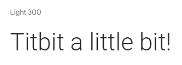

# TITBIT


Titbit is  a free social networking site where users broadcast short posts, where each user can sign u, create his own post, read, update and delete it, and also like/dislike posts from others users, follow other users, comment, like/dislike comments or reply a comment.


Link to deployed site: [Titbit](https://titbit-network.herokuapp.com/)


## 🚀 CONTENTS

* [User Experience](#user-experience)
  * [Project Goals](#project-goals)
  * [User Stories](#user-stories)

* [Design](#design)
  * [Colour Scheme](#colour-scheme)
  * [Typography](#typography)
  * [Imagery](#imagery)
  * [Wireframes](#wireframes)
  * [Database Schema & User Journey](#database-schema--user-journey)
    * [User Journey](#user-journey)
    * [First Draft Database Schema](#first-draft-database-schema)
    * [Final Database Schema](#final-database-schema)

* [Features](#features)
  * [Elements Fount on Each Page](#elements-found-on-each-page)
  * [Future Implementations](#future-implementations)
  * [Accessibility](#accessibility)

* [Technologies Used](#technologies-used)
  * [Languages Used](#languages-used)
  * [Databases Used](#databases-used)
  * [Frameworks Used](#frameworks-used)
  * [Libraries & Packages Used](#libraries--packages-used)
  * [Programs Used](#programs-used)
    * [Error Handling](#error-handling)
    * [Defensive Programming](#defensive-programming)
    * [Database Migration to ElephantSQL](#database-migration-to-elephantsql)

* [Deployment & Local Development](#deployment--local-development)
  * [Deployment](#deployment)
  * [Local Development](#local-development)
    * [How to Fork](#how-to-fork)
    * [How to Clone](#how-to-clone)

* [Testing](#testing)
  
* [Credits](#credits)
  * [Code Used](#code-used)
  * [Content](#content)
  * [Media](#media)
  * [Acknowledgments](#acknowledgments)

- - -

## 📌 User Experience
<details>

<summary>👇</summary>


### Project Goals

- - -


The aim of this project was to build a site that allows users to easily sign up and keep up with titbits.

### User Stories

#### Persona

- - -

The target audience for Titbit are:
* over 18 years;
* titbit lovers all around the world;
* would like to stay informed;
* would like to promote something;
* would like to share informations or their thoughts on social media;
* would like to influence people;
* wants to make jokes;
* would like to engage on society.


#### New Site Users

- - -

As a first time user of the site, I want to be able to:

*Must Have*

* understand what the site is for and how to navigate the site, so I can decide wheter or not to sign up.
* register for an account, so that I can create my profile and explore the website.
* easily navigate the site, so that I can access what I need at the click of a button.


#### **Registered Users**

- - -


As a registered user of the site, I want to be able to:


*Must Have*

* log in to my account, so that I can access the website.
* log out of my account, so that I can end my session.
* have my own profile, so that I can be found from my friends.
* edit my profile, so that I can update or personalize it.
* read the new posts, so that I can keep up to date.
* create, edit, delete and view my posts, so that I can have control of my content.
* know the date and time a post was created, so that I can know how new or old the post is.
* post pictures, so that I can share moments or toughts.
* like or dislike other people's posts, so that I can let them know I enjoyed their posts.
* follow others users, so that I can view their posts on my feed.
* unfollow other users, so that I can remove their post from my feed.
* be followed, so that I can know that other users read my posts.
* view the number of likes on each post, so that I can see which is the most popular or viral.


*Should Have*

* reset my password, so that I can regain access to my account.
* comment on other people's posts, so that I can be involved in the conversation.
* edit or delete my comments on other people's posts, so that I can edit or remove comments I no longer want published.
* reply comments, so that I can interate with others users.
* read the comments of posts, so that I can know the thoughts from others users and follow them.
* like other people's comments on posts, so that I can let them know I enjoyed their comment.
* search for an user, so that I can find a specific user.
* delete other people's comments on my own posts, so that I can remove unwanted commments.
* be notified when other users comment or like my posts or follow/unfollow me.


*Could Have*

* reshare other people's posts, so that I can share their thoughts with my followers.
* message other users, so that I can get in touch with them privately.
* report posts to admins, so that I can notify inappropriate content.
* block users, so that I can hide my content from unwanted users.
 


*Won't Have*

* call users, so that I can communicate with them more quickly.
* create communities, so that I can share content by specific theme.
* write testimonials about other users, so that I can testify about the other users according to the relationship I have with them.


#### **Admin User**

- - -

As an administrator for the site I want to be able to:

*Should Have*
* remove any content from any user that could be offensive, so that I can moderate the all content.
* suspend, block or delete users who not respect the rules, so that I can maintain site guidelines.

*Could Have*
* access a page only for admins to see flagged user posts, so that I can see a list of posts that possibly need to be deleted.
* unflag a post if a deletion is not neede, so that I can remove it from the flagged posts list.

*Won't Have*
* Edit the admin panel.

### Agile
The Project Boards on GitHub was used to help to organize and prioritize the tasks.
The Kanban, as an agile project management tool, helped to visualize the tasks and limit the work in progress (WIP) by moving cards between the To do, In progress and Done columns.

The MoSCow priorization and labels to user stories were used to priorize and implement the features.

* Must Have: guaranteed to be delivered (max 60% of stories)
* Should Have: adds significant value, but not vital (the rest ~20% of stories)
* Could Have: has small impact if left out (20% of stories)
* Won't Have: not a priority for this iteration


</details>

- - - 

## 📝 Design


<details>
<summary>👇</summary>

### Colour Scheme

| Color             | Hex                                                                |
| ----------------- | ------------------------------------------------------------------ |
| Dark charcoal|   #333|
| Light blue |   #d2dfef|
| Blue |   #89b1d6 |
| Dark blue |   #3b81c0 |
| Rosa |  #e95b95 |


### Typography

The [Braah One](https://fonts.google.com/specimen/Braah+One?query=braa) was used for the Logo Titbit in memory of the orkut platform.


The  [Roboto 300 light](https://fonts.googleapis.com/css?family=Roboto:300,400,500,700&display=swap) was used for the body text on the site. Roboto is a sans-serif font which allows it to be legible and is a great choice for accessibility.




### Imagery

* [Emojis](https://github.com/ikatyang/emoji-cheat-sheet/blob/master/README.md)


### Wireframes

Wireframes were created for mobile, tablet and desktop using Balsamiq.

#### __Home Page__


#### __Register Page__


#### __Login Page__


#### __Profile Page__


#### __Error Page__


### Database Schema & User Journey
 
#### User Journey


#### Database Schema

</details>


- - -

## ⚙️ Features

- - -

<details>
<summary>👇</summary>

The website is comprised of X pages which are extended from a base template.

* Home page
* Register page
* Login page
* Logout page
* Profile page
* Edit profile page
* Feed all posts
* Feed from following
* Post detail
* Edit post
* Delete post
* Error page

### Elements found on each page

* Favicon 

  

* Navbar - The Navbar is displayed on all pages of the website and allows users to navigate the site with ease. The navbar is comprised of a logo, the sites name, links to navigate the site and a search bar. The links on the navbar will vary depending on whether a user is logged into their account.

  **User logged in Navbar**
  
  

  **User not logged in Navbar**

  

* Footer - A footer is displayed on all pages of the website.

  

- - -

### Home Page


### Login Page


### Register Page


### Profile Page


### News Page


### Error Page


- - -

### 🧠 Future Implementations 

In future implementations I would like to:

* Add change and reset password functionality to the profile section.
* Give users the option to delete their account in the profile section.
* Allow admin to be able to delete or block users.
* Prepopulate the login fields after a user registers on the site and is redirected to the login page - this is good UX as we shouldn't expect a user to fill in the form with information we already have. 

### 🗣️ Accessibility

I have been mindful during coding to ensure that the website is as accessible friendly as possible. This has been have achieved by:

* Using semantic HTML.
* Using descriptive alt attributes on images on the site.
* Providing information for screen readers where there are icons used and no text.
* Ensuring that there is a sufficient colour contrast throughout the site.


</details>

- - -

## ⚒️ Technologies Used 

<details>
<summary>👇</summary>


### 🌎 Languages Used

HTML, CSS, Javascript, Python

### Databases Used

[🐘 ElephantSQL](https://www.elephantsql.com/)

[Cloudinary](https://cloudinary.com/)

### Frameworks Used

[Flask](https://pypi.org/project/Flask/) - A micro framework.

[Bootstrap](https://getbootstrap.com/) - version 5.2.3 - CSS Framework.

### Libraries & Packages Used


### ⛑ Programs Used 

[Pip](https://pypi.org/project/pip/) - Tool for installing python packages.

[Jinja](https://jinja.palletsprojects.com/en/3.1.x/) - Templating engine.

[Balsamiq](https://balsamiq.com/) - Used to create wireframes.

[Git](https://git-scm.com/) - For version control.

[Github](https://github.com/) - To save and store the files for the website.

[Google Fonts](https://fonts.google.com/) - To import the fonts used on the website.

[Google Chrome Dev Tools](https://developer.chrome.com/docs/devtools/) - To troubleshoot and test features, solve issues with responsiveness and styling.

[Am I Responsive?](http://ami.responsivedesign.is/) To show the website image on a range of devices.

[Shields.io](https://shields.io/) To add badges to the README.


### 🚨 Error Handling 

- - - 

While researching the best way to handle errors in a Flask application using blueprints I came across the following [article](https://nrodrig1.medium.com/flask-blueprints-error-handling-and-config-file-example-d1a031070763). I really liked how this solution allowed me to create a blueprint to custom handle a number of different errors, rather than just creating a single 404 error page.

### Defensive Programming

- - - 

### Database Migration to ElephantSQL


- - -
</details>


## 👩‍💻 Deployment & Local Development

- - -
<details>
<summary>👇</summary>


### Deployment

###  🏡 Local Development

#### How to Fork

To fork the repository:

1. Log in (or sign up) to Github.

2. Go to the repository for this project, [Titbit](https://github.com/luandretta/network).

3. Click the Fork button in the top right corner.

#### How to Clone

To clone the repository:

1. Log in (or sign up) to GitHub.

2. Go to the repository for this project, [Titbit](https://github.com/luandretta/network).

3. Click on the code button, select whether you would like to clone with HTTPS, SSH or GitHub CLI and copy the link shown.

4. Open the terminal in your code editor and change the current working directory to the location you want to use for the cloned directory.

5. Type the following command in the terminal (after the git clone you will need to paste the link you copied in step 3 above):

    ```bash
    git clone { & THE LINK FROM STEP 3 }
    ```

6. Set up a virtual environment (this step is not required if you are using the Code Institute Template in GitPod as this will already be set up for you).

7. Install the packages from the requirements.txt file by running the following command in the Terminal:

    ```bash
    pip3 install -r requirements.txt
    ```

</details>

- - -

## 💬 Testing 

- - -

Please see [TESTING.md](TESTING.md) for all testing performed
- - -

## ®️ Credits 

- - -

<details> 
<summary>👇</summary>

### 🔗 Code Used 

* []()

* [How to ...? - Stack Overflow](https://stackoverflow.com/)
* [How to ...? - W3 Schools](https://www.w3schools.com/django/index.php)
* [Code Institute](https://learn.codeinstitute.net/)
* [GitHub Docs](https://docs.github.com/en/get-started/writing-on-github/working-with-advanced-formatting/organizing-information-with-collapsed-sections) 
* [Markdown Guide](https://www.markdownguide.org/basic-syntax/)
* [Get Bootstrap](https://getbootstrap.com/docs/5.3/forms/overview/) 
* [MD Bootstrap](https://mdbootstrap.com/docs/standard/content-styles/colors/) 
* [CS50’s Web Programming with Python and JavaScript](https://cs50.harvard.edu/web/2020/)
* [Django Allauth](https://django-allauth.readthedocs.io/en/latest/)
* [Bootstrap sticky footer overlapping content](https://stackoverflow.com/questions/26336190/bootstrap-sticky-footer-overlapping-content)
* [Django Channels Crash Course](https://www.legionscript.com/learning/courses/django-channels-crash-course)
* [How to use *args and **kwargs in Python](https://www.youtube.com/watch?v=TbeP0zv5D18)
* [Templates Django-allauth](https://github.com/pennersr/django-allauth)
* [Conventinal Commits](https://www.conventionalcommits.org/en/v1.0.0/)
* [Cloudinary](https://cloudinary.com/documentation/diagnosing_error_codes_tutorial)
* [User Notifications](https://www.youtube.com/watch?v=_JKWYkz597c&list=PLPSM8rIid1a3TkwEmHyDALNuHhqiUiU5A&index=14)
* [Custom template tags and filters](https://docs.djangoproject.com/en/3.1/howto/custom-template-tags/)
* [Making queries](https://docs.djangoproject.com/en/4.2/topics/db/queries/#chaining-filters)
* [How to perform OR condition in django queryset?](https://stackoverflow.com/questions/6567831/how-to-perform-or-condition-in-django-queryset)
* [Django and Static Assets](https://devcenter.heroku.com/articles/django-assets)
* [POP, IMAP, and SMTP settings for Outlook.com](https://support.microsoft.com/en-us/office/pop-imap-and-smtp-settings-for-outlook-com-d088b986-291d-42b8-9564-9c414e2aa040)
* [How to Send Email with Django](https://www.abstractapi.com/guides/django-send-email)

### 📝 Content 

Content for this project was written by me, Lucimeri Andretta. 

### Media

* 

### 👋 Acknowledgments 

I would like to acknowledge the following people who helped me along the way in completing this project: 🫶

</details>

