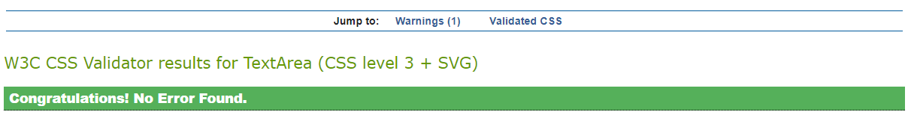
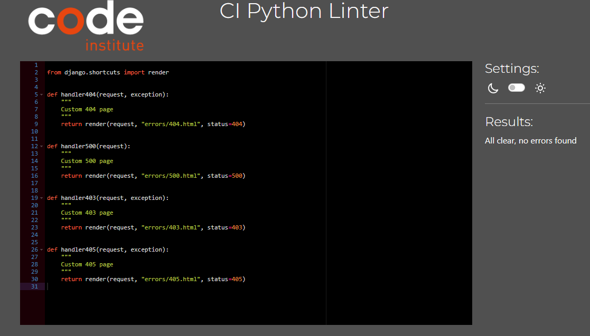

# TESTING

For a proper conclusion to this project several tests were performed.

## 🚀 TABLE OF CONTENTS

* [RESPONSIVENESS TESTING](#responsiveness-testing)
* [BROWSER COMPABILITY TESTING](#browser-compability-testing)
* [BUGS RESOLVED AND UNRESOLVED](#bugs-resolved-and-unresolved)
* [LIGHTHOUSE TESTING OUTCOMES](#lighthouse-testing-outcomes)
* [CODE VALIDATION](#code-validation)
* [USER STORIES TESTING](#user-stories-testing)
* [FEATURES TESTING](#features-testing)
* [AUTOMATED TESTING](#automated-testing)
* [TEST CASE](#test-case)

Return back to the [README.md](README.md) file.

- - -

## RESPONSIVENESS TESTING

The deployed application was tested on multiple devices to check for responsiveness issues. (Which devices, issues)
It works as expected according to the wireframes.
### Mobile


### Tablet


### Laptop


### Desktop


- - -

## BROWSER COMPABILITY TESTING

The deployed project was tested on multiple browsers to check for compatibility issues. (Work as expected?)
### Chrome


### Firefox


### Edge


### Safari


- - -

## BUGS RESOLVED AND UNRESOLVED 
☠️ The issues listed in the table below were indentified during the development of the project.

|N.| Issue |  Action | Status | 
|:---|:--- |:--- |:--- |
|01| Table django_session don't exists | Command: python manage.py migrate sessions | Closed | 
|02 | After migration to codeanywhere, Error: pg_config executable not found | install psycopg2-binary | Closed |
|03 | After migration to codeanywhere, the app didn't run | Create virtual enviroment | Closed |
|04 | Sticky footer overlapping content | Remove class fixed-sm-bottom; add display: flex, direction: column and min-height:100vh to body and margin-top:auto to footer | Closed |
|05 | Bullets in nav list | Edit default in CSS nav ul {list-style-type: none;} | Closed |
|06 | Dropdown menu doesn't display own profile | Change the user.profile.pk to request.user.profile.pk | Closed | 
|07 | Profile_pic doesn't display correctly | Edit templates, change bootstrap classes | Closed |
|08 | Admin couldn't delete post or comment from other users | Edit the template and view adding request.user.is_superuser |
|09 | Inpunt form doesn't clean after submit | Add class form-control | Closed |
|10 | Default profile_pic doesn't display | Add boolean to templates | Closed |
|11 | Reply comment icon button doesn't work. Parent_id was not found. | Remove '' from argument in the function. | Closed |
|12 | Default profile picture doesn't be displayed at followers_list. | Edit the template followers_list with boolean | Closed | 
|13 | ConnectionRefusedError at /accounts/password/reset/ | Google and Gitpod don't see eye-to-eye and will not send emails from a Google SMPT account. Use outlook account to send email to reset password  | Closed |
|14 | Skip collestactic at Heroky during deployment | Run the command **python manage.py collectstatic** then deploy the project again. | Closed|
|15 | Couldn't test the application using a free version of Elephant as a database | Create a temporary database to test the application | Closed |
|16 | Post and Comment form doesn't clear after it's submitted | Call the empty form after save the content posted | Closed |
|17 | After changed the password redirects to change password page | Add a path with reverse_lazy to overwrite django allauth | Closed |
|18 | Post author couldn't delete comments in own post | Edit view and template adding if request.user == post.author. | Closed |
|19 | The table of contents on the README.md an TESTING.md doesn't work due to emojis in titles. | Remove all emojis from titles. | Closed|
|20 | NameError: name 'settings' is not defined | Remove the static from urls | Closed |

There are no remaining bugs.

- - -

## LIGHTHOUSE TESTING OUTCOMES

The deployed project was tested using the Lighthouse Audit tool to check for any major issues. The results for each page are listed bellow.

- Home (Landing page - not Logged in)


- Sing Up


- Sing In


- Sing Out


- Forgot Password 


- Change Password


- Home (Main Feed - Logged in)


* Best Practices: Displays images with incorrect aspect ratio - this will happen due to the uploading of photos by the user.

- Following


- Post Detail


- Edit post


- Delete post


- Edit comment


- Delete comment


- Users


- Search


- Profile


- Profile Update


- Followers


- - -

## CODE VALIDATION

### HTML

The [HTML W3C Validator](https://validator.w3.org/) to validate all HTML files.
In order to properly validate the HTML pages with Jinja syntax, the steps are followed for each file:

- Navigate to the deployed application using Google Chrome,
- Right-click anywhere on the page, and select View Page Source.
- Copy the entire "compiled" code, without any Jinja syntax., and use the validate by input method.

The result for each page are listed bellow:

- Home (Landing)

- Sing Up

- Sing In

- Sing Out

- Forgot Password

- Home (Main Feed - Logged in)

- Following

- Post Detail

- Edit post

- Delete post

- Edit comment

- Delete comment

- Users

- Search

- Profile

- Profile Update

- Followers


### CSS
The [CSS Jigsaw Validator](https://jigsaw.w3.org/css-validator/) was used to validate the CSS file.

| File | Screenshot | Notes |
| --- | --- | --- |
| style.css |  |  |


### JAVASCRIPT

The [JShint Validator](https://jshint.com/) was used to validate the JavaScript file.

| File | Screenshot | Notes |
| --- | --- | --- |
| titbit.js |  | Unused variables: commentReply Toggle, showNotifications and removeNotifications |

### PYTHON

The [Code Institute Python Linter](https://pep8ci.herokuapp.com)was used to validate all Python files.

#### Network project

- Settings.py


- urls.py (main)


- views.py



#### Home app

- urls.py 


- views.py


- custom_tags.py


#### Titbit app

- admin.py


- forms.py


- models.py


- tests.py


- urls.py


- views.py


- - -

## USER STORIES TESTING

The User Stories testing  were listed bellow:


- - -

## FEATURES TESTING

- - -

## AUTOMATED TESTING

The Django's Built-in Unit Testing Framework was used to test the application functionality on the project without errors.
To perform the test the following step was used:
- In the terminal type the command:

```bash
python3 manage.py test
```


- - -

## TEST CASE

A test case were written to proof the post feature and the delete post. A creation of a temporary database was needed.
Ran 2 tests without issues.


